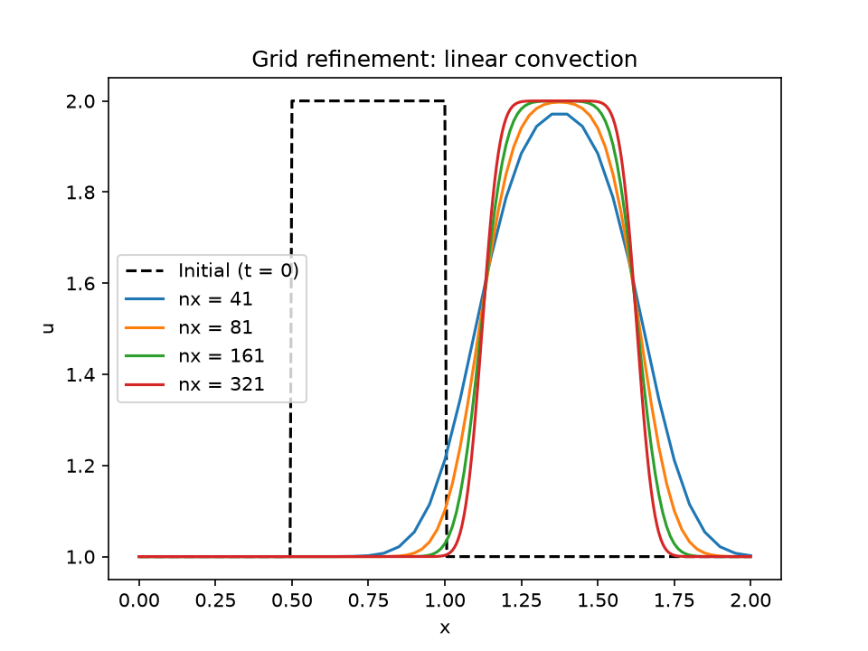

# 1D Linear Convection Solver

A finite difference solver for the 1D linear convection equation, written in C++, with Python/Matplotlib for visualization.



*The hat-shaped initial condition (dashed) after travelling a distance of 0.625, computed on four grids (nx = 41 to 321). Finer grids keep the shape sharper, because numerical diffusion shrinks as the grid spacing decreases.*

## Overview

I am building this project to understand computational fluid dynamics (CFD): how fluids behave, and how computation can be used to study them. It follows the structure of Prof. Lorena Barba's *12 Steps to Navier-Stokes*, re-implemented from scratch in C++.

The project is a work in progress. It currently solves 1D linear convection; diffusion, Burgers' equation and 2D versions are planned.

## Physics

The 1D linear convection equation:

$$\frac{\partial u}{\partial t} + c\,\frac{\partial u}{\partial x} = 0$$

- $u(x, t)$ is the quantity being transported (think of dye concentration in a pipe)
- $x$ is position, on the domain $[0, 2]$
- $t$ is time
- $c$ is the constant wave speed ($c = 1$)

The equation describes a shape being carried along by a flow at speed $c$ without changing form, like dye carried by steadily flowing water.

**Initial condition** (a "hat" function):

$$u(x, 0) = \begin{cases} 2 & 0.5 \le x \le 1 \\ 1 & \text{otherwise} \end{cases}$$

**Boundary condition:** $u(0, t) = 1$ (a fixed-value, or Dirichlet, condition). Whatever flows in from the left is assumed to be at the background value.

## Numerical Method

- The domain is discretized into `nx` evenly spaced points, with spacing $\Delta x = 2 / (nx - 1)$.
- The time derivative uses a forward difference and the space derivative a backward difference. This is the **first-order upwind scheme**: it looks in the direction the flow comes from.
- The scheme is explicit: each new value is computed directly from the previous time step:

$$u_i^{n+1} = u_i^n - \frac{c\*\Delta t}{\Delta x}\left(u_i^n - u_{i-1}^n\right)$$

- The time step is set from the **Courant number** $C = c\*\Delta t / \Delta x = 0.5$, and the number of steps is chosen so the wave travels a fixed distance.

## Verification

Before running on fine grids, I derived the update rule by hand and computed two time steps on paper (nx = 5, c = 1, Δt = 0.25, C = 0.5). The code reproduces them exactly:

| Step | u (hand calculation and code) |
|---|---|
| 0 | 1, 2, 2, 1, 1 |
| 1 | 1, 1.5, 2, 1.5, 1 |
| 2 | 1, 1.25, 1.75, 1.75, 1.25 |

On the nx = 41 grid, the centre of the bump ends at x = 1.375, matching the expected shift of $c \cdot t = 0.625$ from its starting centre at 0.75.

## Results: Numerical Diffusion

The exact solution keeps its sharp rectangular shape, but the computed one smears: on the coarsest grid (nx = 41), the peak drops from 2 to about 1.97 and the edges spread out.

This smearing is not physics. It comes from truncation error, from replacing true derivatives with differences between neighbouring points, and is known as **numerical diffusion**. The grid convergence study above shows it shrinking as the grid is refined, while the bump's position stays the same on every grid.

## How It Works

1. `src/main.cpp` builds the grid, sets the initial condition, runs the time loop, and writes the results to a CSV file in `output/`.
2. Python scripts in `scripts/` read the CSV files and plot them.

## Build and Run

**Requirements:** a C++ compiler (g++), Python 3, NumPy and Matplotlib.

```bash
pip install numpy matplotlib
```

Run all commands from the repository root:

```bash
mkdir build                                        # first time only
g++ -Wall -Wextra src/main.cpp -o build/main.exe
.\build\main.exe                                   # Linux/macOS: compile with -o build/main and run ./build/main
```

To reproduce the grid convergence plot, set `nx` in `src/main.cpp` to 41, 81, 161 and 321 in turn, recompiling and running each time. Then:

```bash
python scripts/grid_refinement.py
```

## Acknowledgments

Based on the structure of Prof. Lorena Barba's *12 Steps to Navier-Stokes* ([CFDPython](https://github.com/barbagroup/CFDPython)). All code in this repository is my own implementation.
